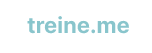
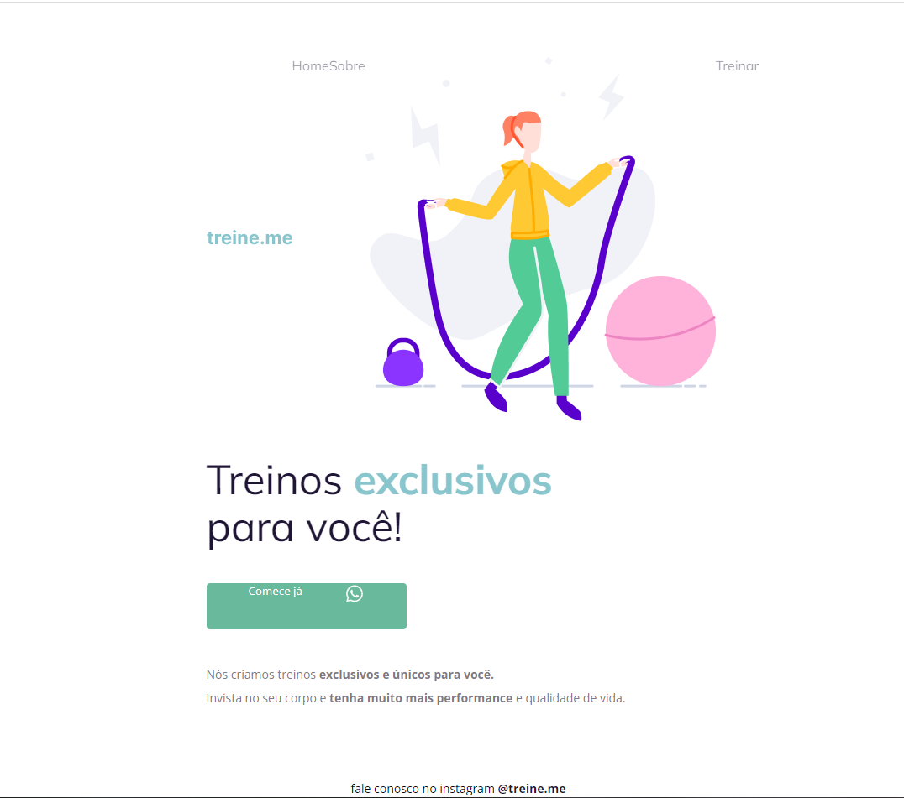
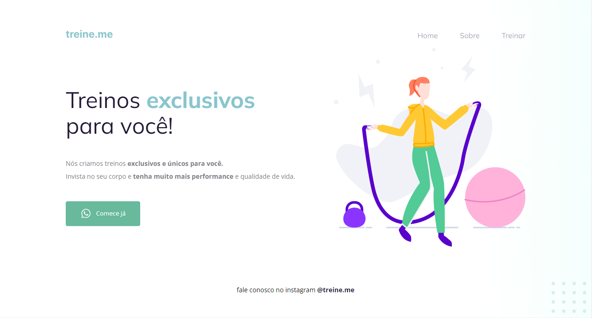

<h1 align="center">
  
</h1>

<h2 align="center" >Descrição do Projeto</h2>

  O Treine.me é 2° desafio do Nivel 02 do programa Explorer da Rockeseat.

 

   
Desafio tem como principal objetivo a correção dos bugs no layout, utilizando os conhecimentos adquiridos com as tecnologias de HTML e CSS com conceitos do flebox.

  <h3 align="center">Layout antes dos ajustes:</h3>
       
  
  
  <h3 align="center">Layout depois dos ajustes:</h3>
       
  

## :rocket: Tecnologias

Esse projeto foi desenvolvido com as seguintes tecnologias:

✔️ HTML

✔️ CSS

✔️ Flex-box
